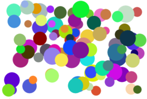
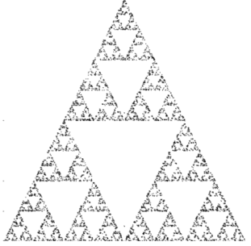
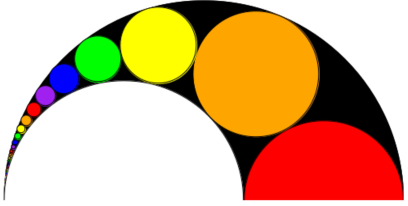
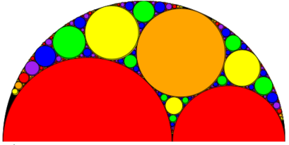

# Racket Geometry

A bunch of implementations of cool geometry things in the Racket programming language.

## 100 Circles

Just as the name implies.

## Chaos Game

Generating Sierpinski's Triangle using randomization.

## Pappus Chain

A fractal made with circles (and inversive geometry).

## Apollonian Gasket

Taking the Pappus Chain to the next level.

